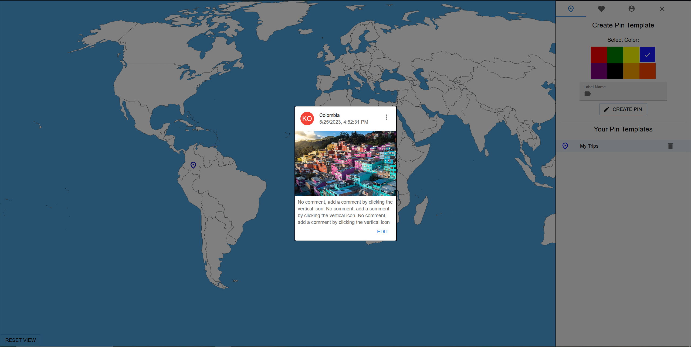

# Mapeeter

Mapeeter is an interactive map application that allows users to mark the places they have visited, share their experiences with others. It provides a fun and social way to explore the world and connect with fellow travelers.

## Implemented Features

- Virtual travel map with pins to visually track your travel journey
- Mark the places you have visited using pins on an interactive map
- Hover over a country to view additional information
- Share memories from your visited places with comments
- Customization options for pins, including labels and color customization
- Pin highlighting when searching for a specific country in the search bar

## Future Features

- Social aspect: Discover where others have been and read their comments about different locations
- Plan your next travel destinations by marking places you want to visit
- Upload one image per place visited to capture the vibe of each location
- Table showing the most visited places by users
- Countries are color-coded, and cities/states can be color-coded based on current temperature or other parameters
- Search bar for finding specific places quickly
- Fun facts and top travel places based on real-time data
- Live feed showcasing recent top spots and animating horizontally across the bottom of the screen
- Ability to tag people in your friend list and have followers/follow functionality
- Map customization options, including the ability to hide minor cities, change colors, and add personalized icons

## Stack

The Mapeeter application is built using the following technologies:

- Frontend:
  - React.js
  - Material-UI (UI component library for React)
- Backend:
  - Node.js
  - Express (web application framework for Node.js)
  - PostgreSQL (database for storing user data)
  - Supabase (open-source Firebase alternative with real-time data syncing)

## WIP Images

